# Mockito教程

## 第一章 快速入门

### 1.引入jar包

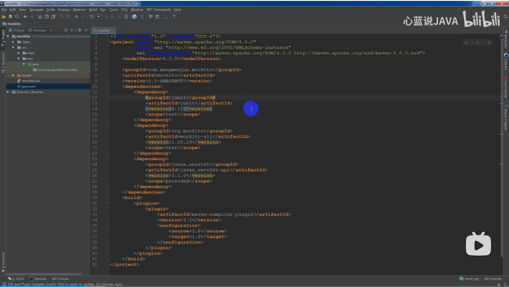

### 2.入门实例代码

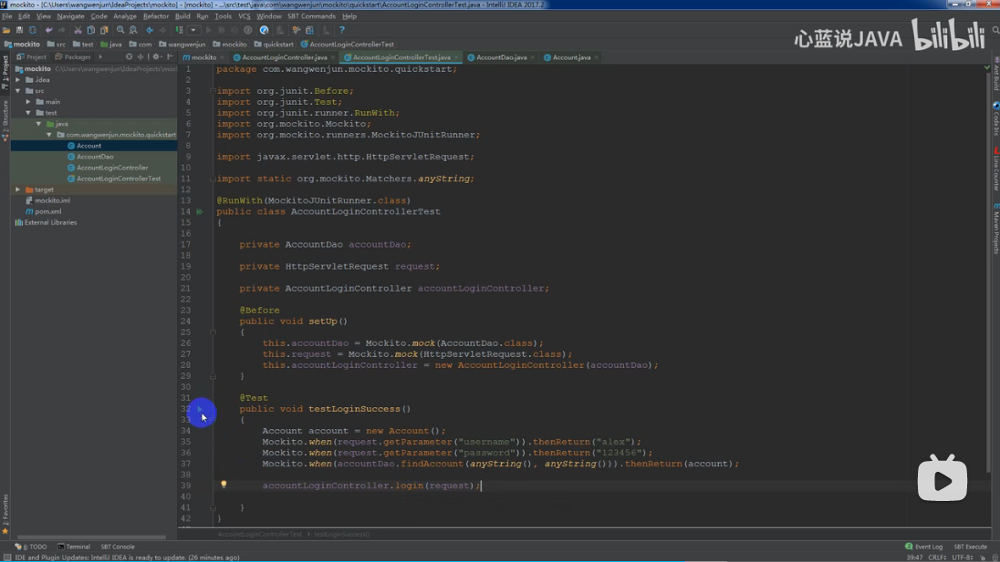

## 第二章 Mock

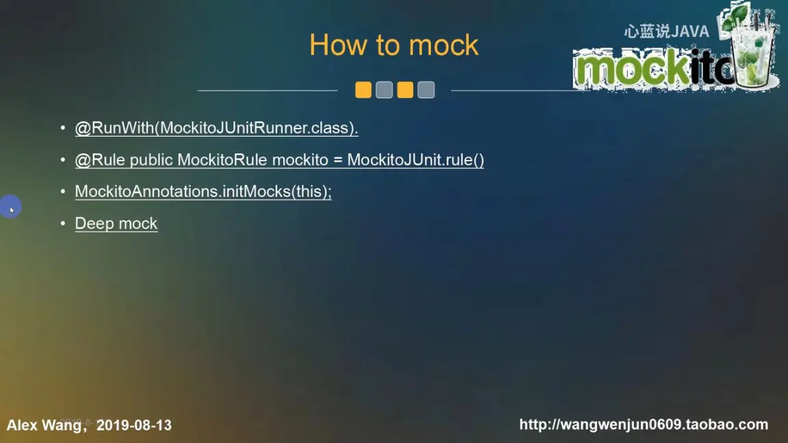

### 1.Use runner

@RunWith(MockitoJUnitRunnber.class)

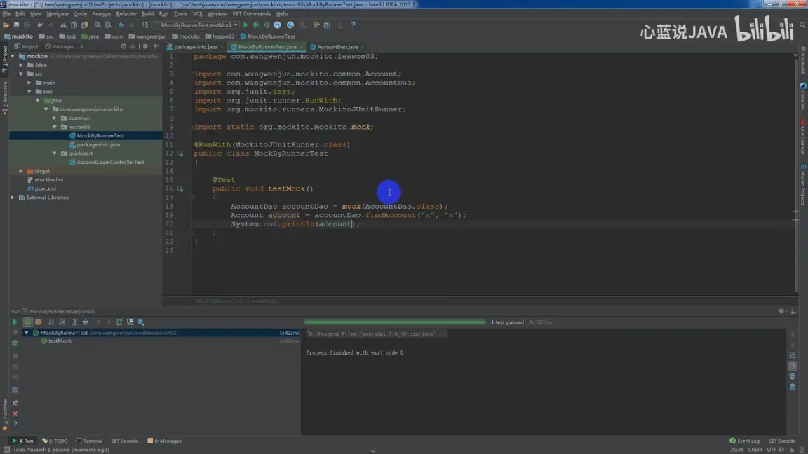

mock方法的第二个参数决定mock对象返回什么，默认使用defaultAnswer，某些类可以返回一个对象，其他返回null

Mockito.RETURN_SMART_NULLS会返回一个字符串

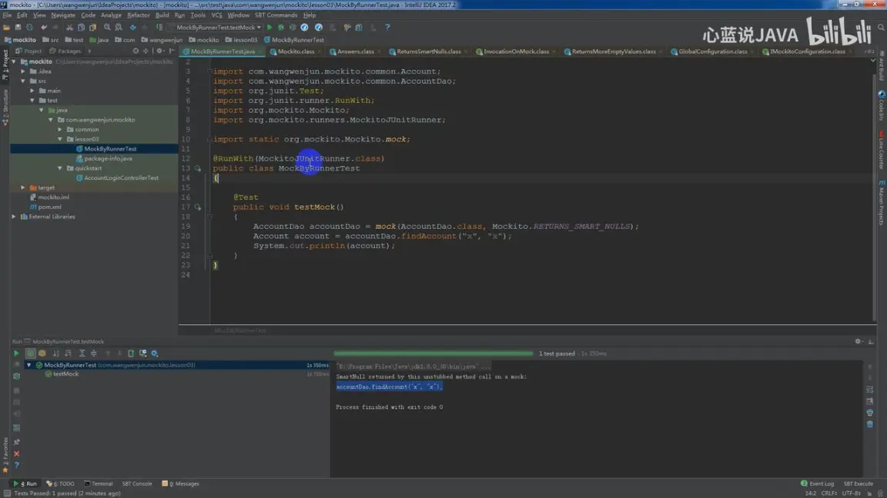

### 2.Mock by Annotation

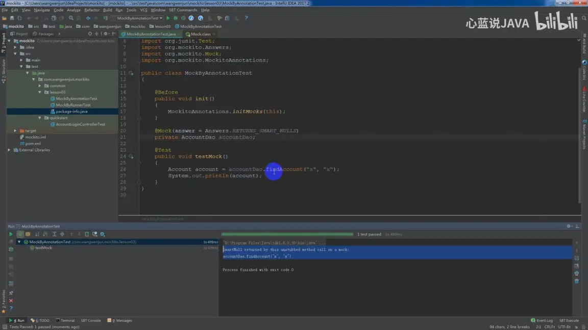

### 3.Mock by rule

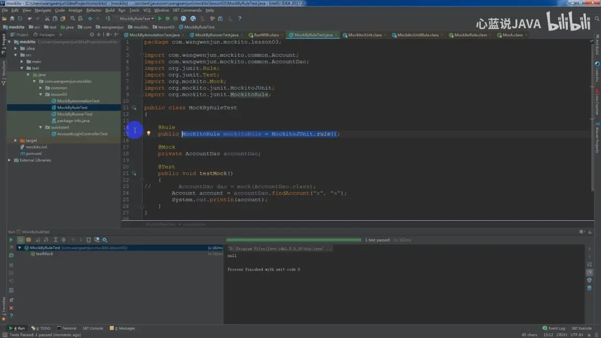

### 4.Deep mock

针对链式编程，即连续点的情况

#### 4.1 基本方法

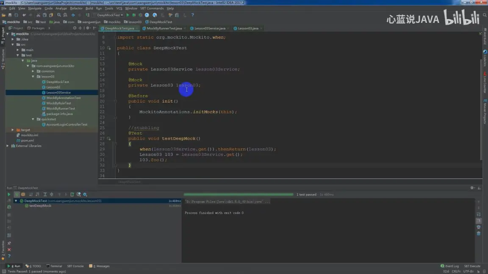

#### 4.2 deep方法

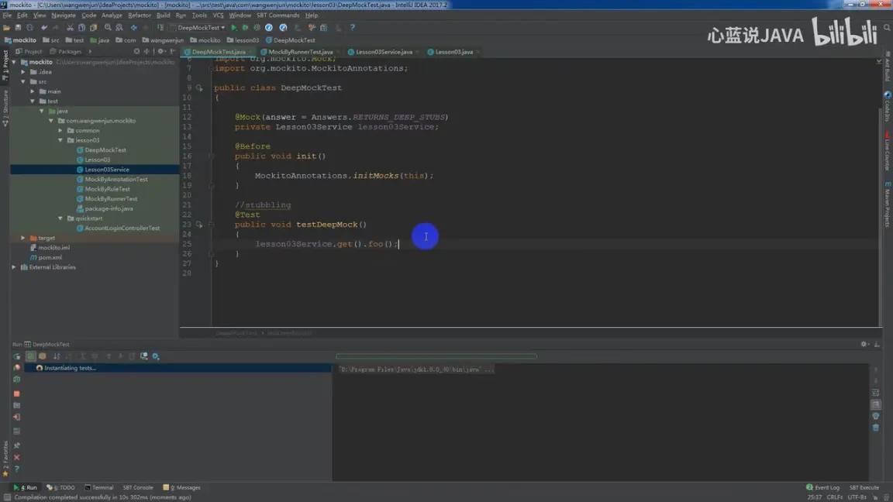

## 第三章 Stubbing

### 1. how to stubbing

例子：

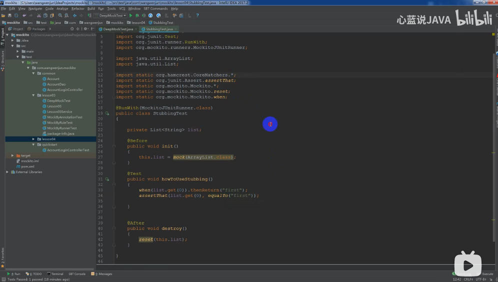

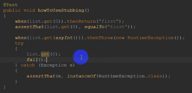

### 2. stubbing无返回值的方法

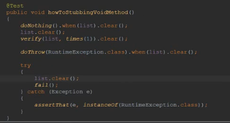

### 3. doReturn方法做stubbing

等价于1小节中的写法

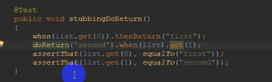

### 4. 一次stubbing返回多个值

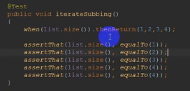

等价于多次调用thenReturn（链式调用法）

### 5.  stubbing answer

自己写逻辑做返回值，可以对不同的入参返回不同的值

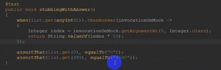

### 6. 调用真正的方法

mock返回的对象是cglib代理类，不会调用真正的方法,使用thenCallRealMethod调用自身method

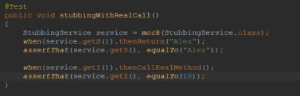

## 第四章 Spying

属于部分mock，spy返回的对象上调用未stubing方法将调用真正的方法，和mock刚好相反

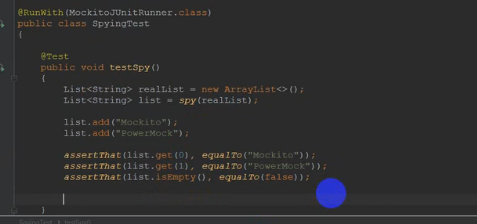

上面没有stubbing，只有spy，调用的是真正的方法

但是如果有stubbing,那么相应的方法会有mock行为，如下红框

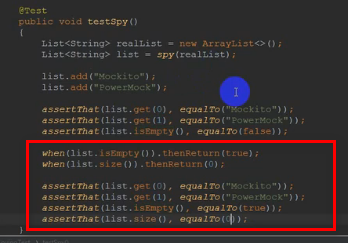

spy对象可以使用annotation方式产生

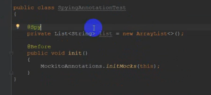

## 第五章 Argument Matchers

### 1. 直接匹配

能匹配参数的stubbing返回相应的值，不能匹配则只能返回一些默认值。判断参数是不是匹配使用equals方法比较。

### 2. isA()

isA判断传入的参数是否某个类(及其子类)的实例(使用instanceof判断)，如下，Child1, Child2是Parent的子类，可以用isA匹配

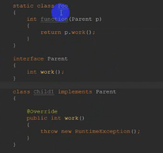

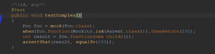

或者类本身也匹配，匹配不上只能返回默认值。

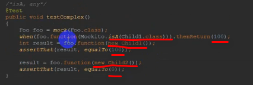

### 3. any() 匹配

永远匹配成功，所以不论给的什么类型都认为匹配

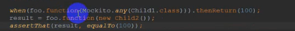

### 4. any...()

anyInt,  anyString, anyCollection, anyObject等等

配测试类：

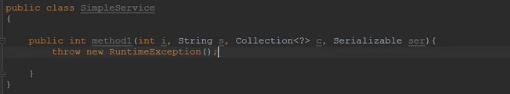

测试类：

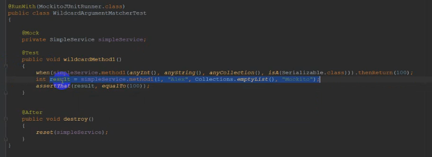

>一旦使用了匹配函数，则不允许再使用直接匹配，这个时候可以使用eq方法达到相同的目的
>
>例如：
>
>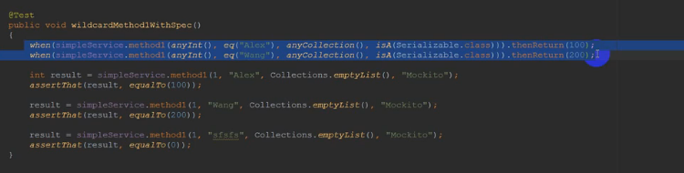
>
>如果一个调用能匹配到多个stubbing,则最后一个将生效

### 5. doNothing()

不产生返回值,针对返回值为void的被测试方法

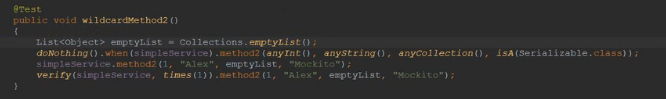

## 第六章 Hamcrest matcher

### 1.内置matcher做断言

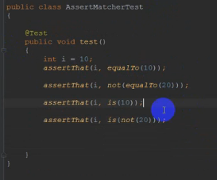

可以使用either/both/anyOf/allOf将多个结果连起来

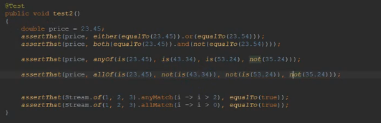

### 2.自定义matcher做断言

> 继承自BaseMatcher

实现：

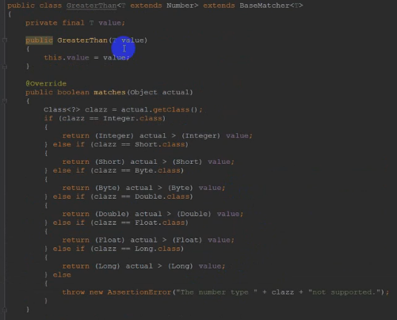

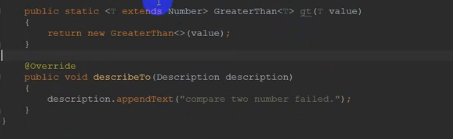

使用：

